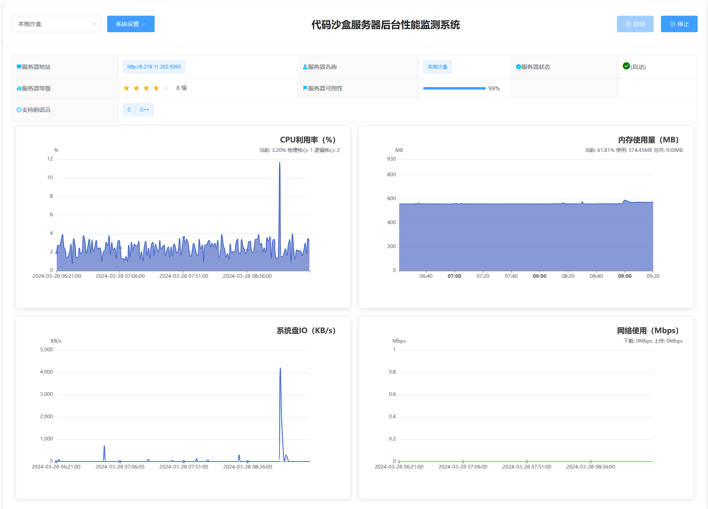
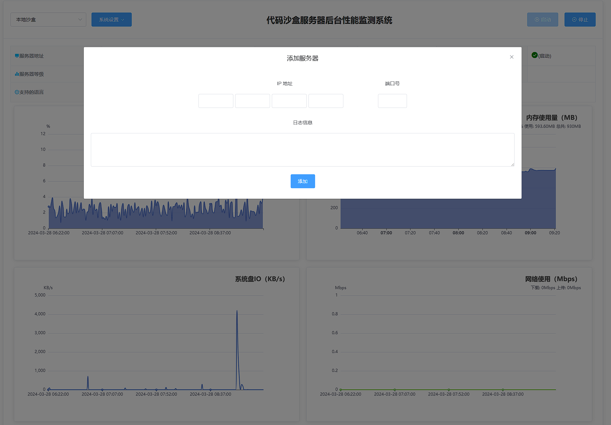
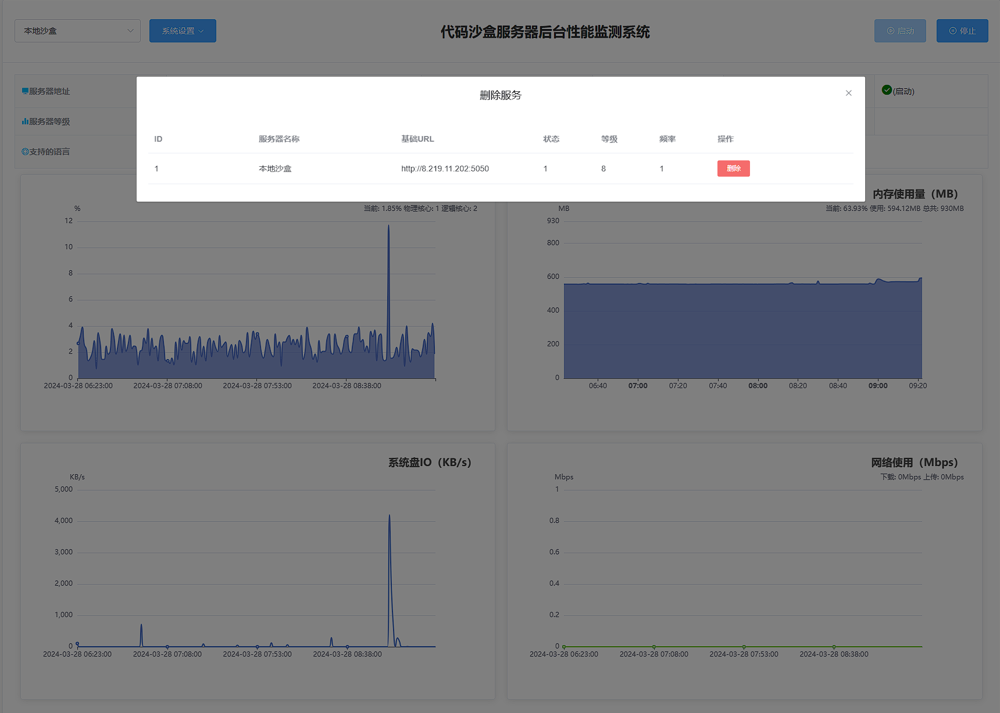
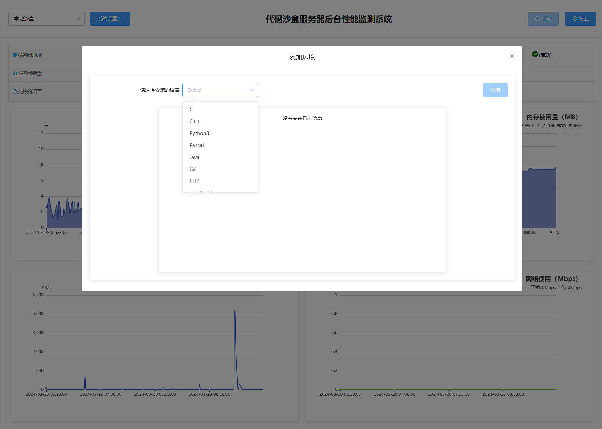

# 快速启动

## 有沙盒

使用以下`docker-compose.yml`文件搭建带有沙盒的判题系统，适合体验判题机的功能：

```
version: '3'

services:
  go-judge:
    image: pllysun/go-judge:complete
    privileged: true
    shm_size: 256m
    ports:
      - '5050:5050'

  java-app:
    image: pllysun/d-judge:sandbox
    ports:
      - '6005:6005'
    depends_on:
      - go-judge
```

## 无沙盒

如果只需要判题机本身，可使用以下步骤：

### 判题机镜像

运行以下命令启动判题机镜像：

```
docker run -itd -p 6005:6005 --name dj pllysun/d-judge:latest
```

### 代码沙盒镜像

在需要运行代码沙盒的服务器 上运行下面的命令来创建代码沙盒服务器。

```
docker run -itd --rm --privileged --shm-size=256m -p 5050:5050 --name=j0 pllysun/go-judge:1.0
```

### 使用无沙盒判题机

运行完毕后，登录 localhost:6005来添加运行代码的沙盒服务器。该步骤涉及挂载数据库文件、日志文件和资源文件到宿主机，确保按照需要进行配置。

具体页面如下图:

监控页

添加服务页

可以在这里添加判题沙盒服务，通过判题沙盒服务的IP地址和端口添加即可


删除服务


安装运行环境
目前只支持特定环境的安装，如果需要自定义安装代码运行环境，可以自己进入容器内部安装。

# 运行&测试

[判题机 API在线文档](https://apifox.com/apidoc/shared-d820fb9a-54b2-4410-8097-49e725a5cf95/doc-3625437)

请求地址:localhost:6005/judge

请求参数

```
{
    "modeType": "oi",
    "code": "#include <iostream>\nusing namespace std;\nint main() {\nint a, b;\ncin >> a >> b;\ncout << a + b << endl;\n}",
    "language": "C++",
    "oiString": "1 1"
}
```

成功响应

```
{
    "code": 200,
    "msg": "成功",
    "data": {
        "0": {
            "exitStatus": 0,
            "files": {
                "stderr": "",
                "stdout": "2\n"
            },
            "memory": 1826816,
            "originalStatus": "Accepted",
            "runTime": 4581372,
            "status": 0,
            "time": 2660000
        }
    }
}
```

